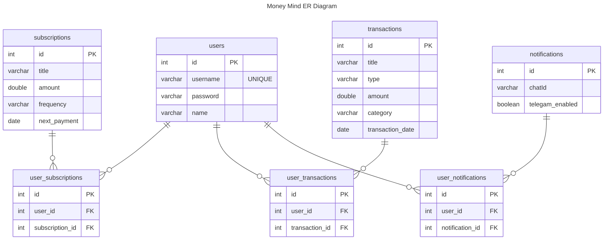
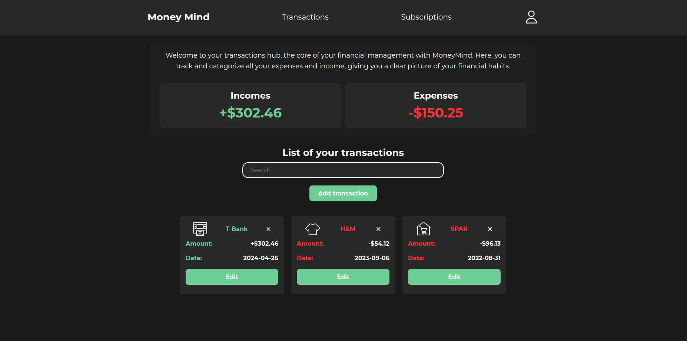
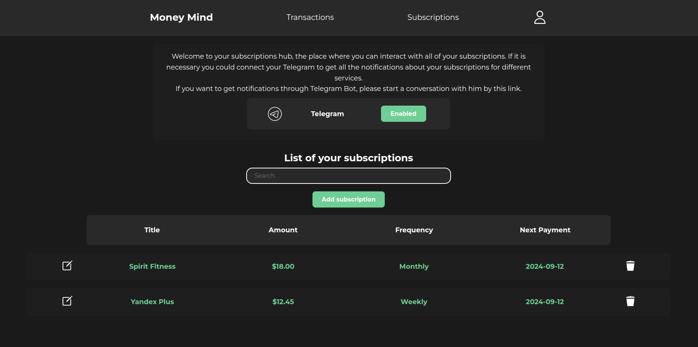
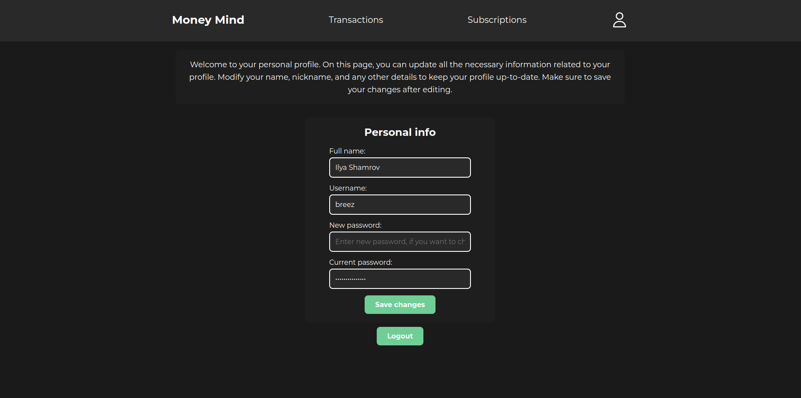
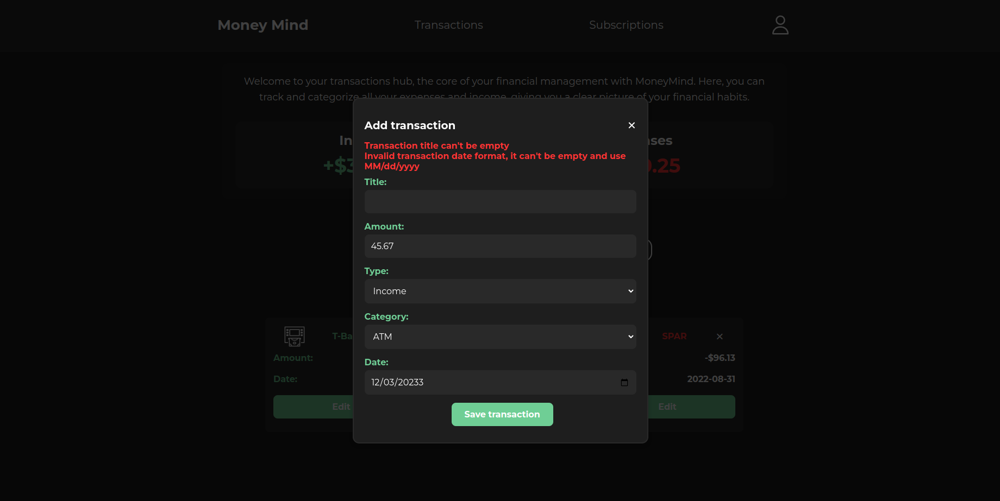
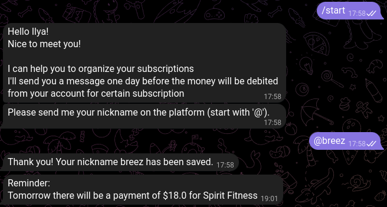

# Money Mind

Money Mind is a personal finance management tool developed using Java and Spring Framework. It helps users manage their
spending, track income, and handle subscriptions. The app allows easy recording and categorization of financial
activities, sends reminders for upcoming payments, and delivers notifications via Telegram. With a user-friendly
interface and robust data encryption, it ensures both convenience and security in managing personal finances.

### Table of Content
- [Tech Stack](#tech-stack)
- [How To Run The Application](#how-to-run-the-application)
- [ER Diagram](#er-diagram)
- [Appearance](#appearance)

### Tech Stack:

- Java 17
- Spring Boot
- Spring MVC
- Spring Data JPA
- Spring Security
- Hibernate
- Thymeleaf
- Javax Validation API
- PostgeSQL
- Maven
- Docker

Authentication is implemented using JWT. When a user logs in, they provide their credentials,
which include a username and a password. All users passwords are securely stored in the database in an encrypted form
using BCrypt hashing.

### How To Run The Application

To test or use the application locally, follow these steps:

1. **Configure the application**: Fill in the `application.properties` file located in the `src/main/resources/`
   directory.
   Here's
   an example:
    ```properties
    # Database Connection
    spring.datasource.url=jdbc:postgresql://localhost:5432/your_database_name
    spring.datasource.username=your_username
    spring.datasource.password=your_password
    # Bot Configuration
    bot.name=MoneyMindBot
    bot.token=your_bot_token
    ```

2. **Run the application locally**: Use Maven to build the project `mvn package` and start the Spring Boot application.

Alternatively, you can run the application in Docker:

1. **Prepare the Docker environment**: Make sure `Docker` and `Docker Compose` are installed. Clone the repository, then
   configure the `.env` file similar to the example below:

   ```properties
   # PostgreSQL Database in Container
   POSTGRES_DB=your_database_name
   POSTGRES_USER=your_username
   POSTGRES_PASSWORD=your_password
   # Database Connection
   SPRING_DATASOURCE_URL=jdbc:postgresql://postgres:5432/your_database_name
   SPRING_DATASOURCE_USERNAME=your_username
   SPRING_DATASOURCE_PASSWORD=your_password
   # Bot Configuration
   BOT_NAME=MoneyMindBot
   BOT_TOKEN=your_bot_token
   ```

2. **Start the application**: Run the `start.sh` script after configuration, then access the application
   at http://localhost:8080/.

### ER Diagram



### Appearance:

#### Main Page


#### Transactions page



#### Subscriptions Page



#### User Profile



#### 404 Page


#### Example of Incorrect Input



#### Example of Telegram Bot usage

