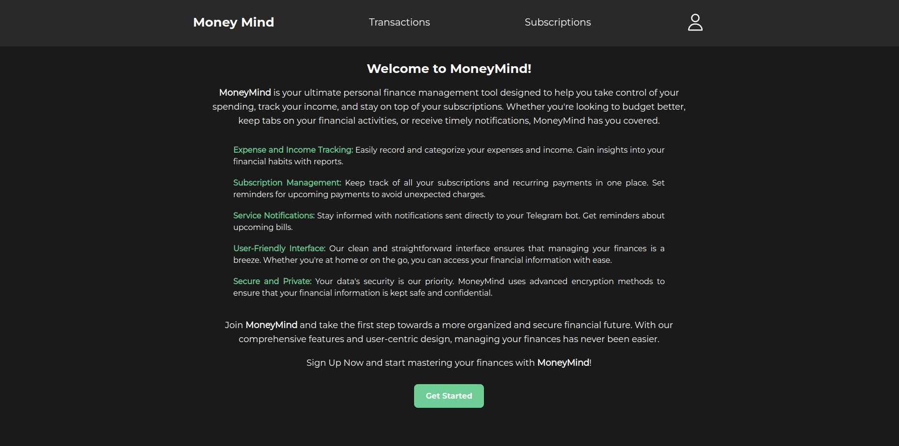
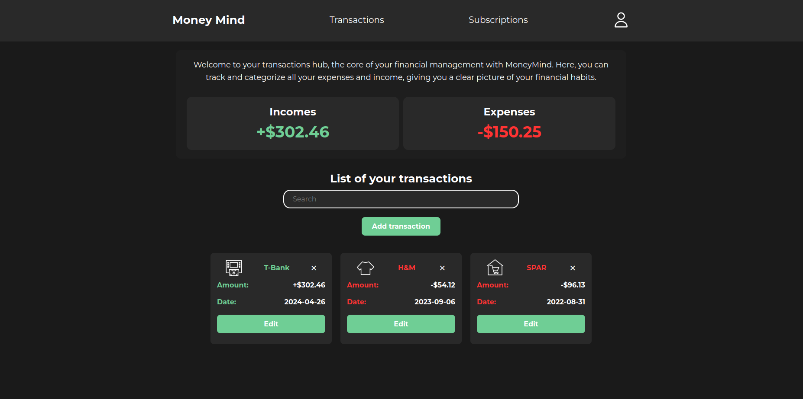
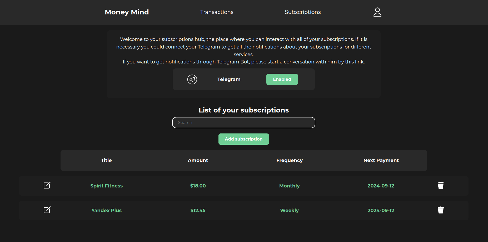
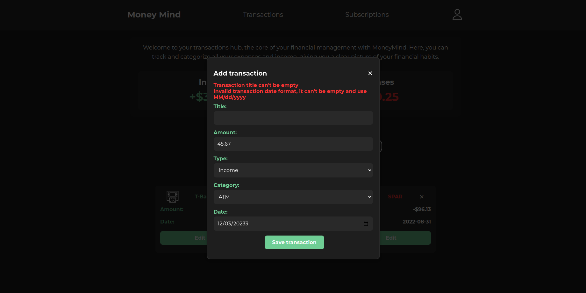
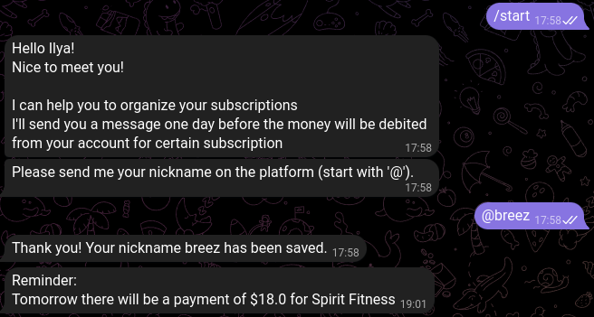

# Money Mind

Money Mind — это инструмент для управления личными финансами, разработанный с использованием Java и Spring Framework. Он
помогает пользователям контролировать расходы, отслеживать доходы и управлять подписками. Приложение позволяет легко
записывать и классифицировать финансовую активность, отправляет напоминания о предстоящих платежах и уведомления через
Telegram. Благодаря удобному интерфейсу и надежному шифрованию данных оно обеспечивает как удобство, так и безопасность
в управлении финансами.

### Технологический стек:

- Java 17
- Spring Boot
- Spring MVC
- Spring Data JPA
- Spring Security
- Hibernate
- Thymeleaf
- Javax Validation API
- PostgeSQL
- Maven
- Docker

Аутентификация реализована с использованием JWT. Когда пользователь входит в
систему, он предоставляет свои учетные данные, которые включают имя пользователя и пароль. Все пароли пользователей
безопасно хранятся в базе данных в зашифрованной форме с использованием хеширования BCrypt.

### Как запустить приложение

Для тестирования или использования приложения локально выполните следующие шаги:

1. **Настройте приложение**: заполните файл `application.properties`, который находится в директории
   `src/main/resources/`.
   Пример:

   ```properties
    # Database Connection
    spring.datasource.url=jdbc:postgresql://localhost:5432/your_database_name
    spring.datasource.username=your_username
    spring.datasource.password=your_password
    # Bot Configuration
    bot.name=MoneyMindBot
    bot.token=your_bot_token
    ```

2. **Запустите приложение локально**: используйте Maven для сборки проекта командой `mvn package` и запуска Spring Boot
   приложения.

Другой вариант, вы можете запустить приложение в Docker:

1. **Подготовьте среду Docker**: убедитесь, что Docker и Docker Compose установлены. Склонируйте репозиторий и настройте
   файл .env по примеру:

   ```properties
   # PostgreSQL Database in Container
   POSTGRES_DB=your_database_name
   POSTGRES_USER=your_username
   POSTGRES_PASSWORD=your_password
   # Database Connection
   SPRING_DATASOURCE_URL=jdbc:postgresql://postgres:5432/your_database_name
   SPRING_DATASOURCE_USERNAME=your_username
   SPRING_DATASOURCE_PASSWORD=your_password
   # Bot Configuration
   BOT_NAME=MoneyMindBot
   BOT_TOKEN=your_bot_token
   ```

2. **Запустите приложение**: выполните скрипт `start.sh` после настройки, затем откройте приложение по
   адресу http://localhost:8080/.

### ER модель


### Внешний вид:

#### Главная страница



#### Страница транзакций



#### Страница подписок



#### Профиль пользователя


#### Страница 404


#### Пример некорректного ввода



#### Пример использования Telegram-бота

